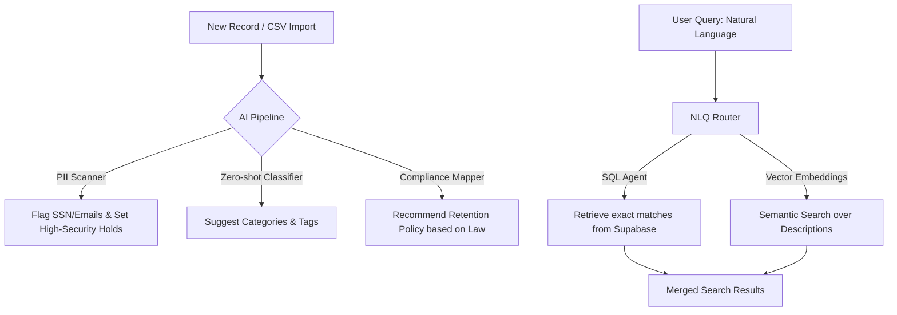
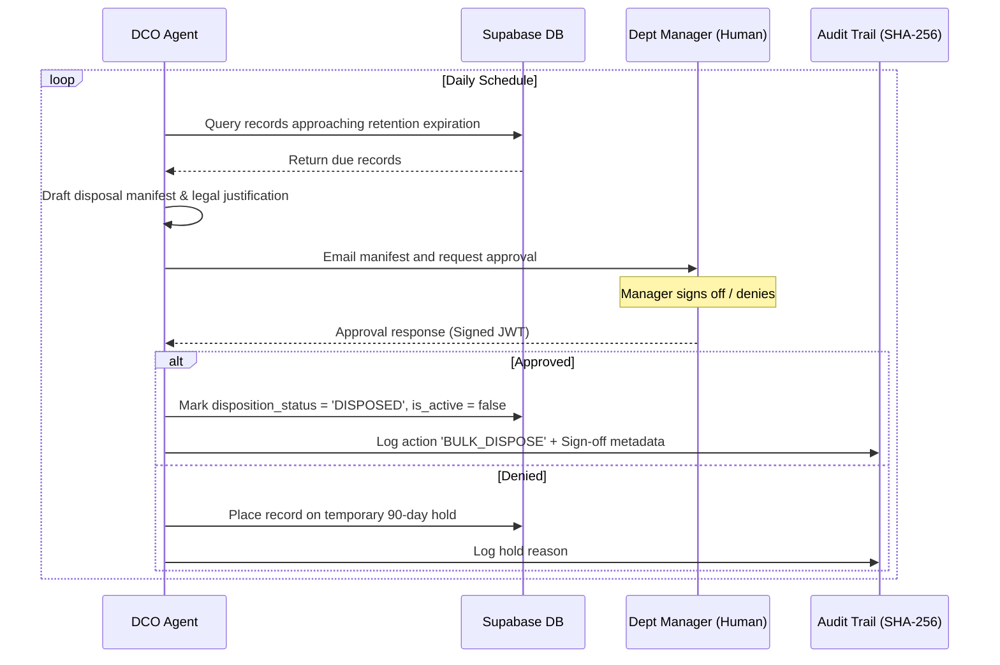

# AI & Autonomous Agents Enhancement Roadmap
## SpiderSmart Inventory Management System (IMS)

This document provides a detailed analysis of the current **SpiderSmart IMS** architecture and offers a strategic roadmap for enhancing the system. It covers traditional feature upgrades, advanced AI integration, and autonomous background agent workflows.

---

## 1. Current System Analysis

The existing SpiderSmart IMS is a robust, metadata-centric inventory tracker for physical assets. Here is an assessment of its current features, strengths, and limitations:

| Core Module | Current Implementation | Strengths | Current Limitations |
| :--- | :--- | :--- | :--- |
| **Authentication** | JWT Auth with RBAC (Admin, Auditor, User) | Secure, standard, scoped filters in schema | Lacks active session monitoring, MFA, or dynamic permission changes. |
| **Data Models** | Hierarchical Entities, Departments, Categories, & Locations | Clean relational database schema in Supabase | Barcodes are free-form strings; lacks structural warehouse mapping (shelf/row). |
| **Record Registry** | Dynamic Form Engine, custom JSON fields, auto-increment versions | High flexibility for custom assets, point-in-time recovery | Barcode lookup is strict keyword match; manual metadata entry is tedious. |
| **Classification** | Word-frequency pattern suggestions & rule-based condition matches | Regex & string-based rules apply retroactively | Rules must be manually configured; cannot handle fuzzy matching or context. |
| **Retention/Hold** | Sweep rules that mark records `DUE` based on static policies | Tamper-evident SHA-256 blockchain audit logs | Sweeps run on cron; no notification loops to department heads before destruction. |
| **Reporting/Export** | CSV, Excel, and PDF builders; scheduled background cron exports | Immutable audit zip exports for forensic legal audits | Static filters only; users cannot query data using natural language. |

---

## 2. Recommended Features (Traditional Upgrade)

Before adding AI, several structural upgrades can make the IMS more robust and prepared for AI layers:

### 2.1 Warehouse Location mapping (Aisle-Shelf-Bin Routing)
* **Goal:** Instead of just a generic text field for `location`, implement a structural hierarchy: `Warehouse -> Aisle -> Row -> Shelf -> Position`.
* **Value:** Allows the system to optimize where boxes are stored (e.g., placing frequently retrieved categories closer to the dispatch area).

### 2.2 Pre-disposition Approval & Notifications Workflow
* **Goal:** When records are flagged as `DUE` for disposition, they enter an approval pipeline.
* **Value:** System notifies department managers via email or in-app dashboard. Records are only destroyed (marked `DISPOSED`) after double-signoff, logging each signoff in the immutable audit trail.

---

## 3. AI-Powered Upgrades (Machine Learning & LLMs)

Integrating artificial intelligence can transform the IMS from a passive record store into an active compliance and search assistant.

### 3.1 Semantic Search & Natural Language Query (NLQ)
* **How it works:**
  1. Add a vector column (`embedding` vector) to `inventory_records` using PostgreSQL's `pgvector` extension in Supabase.
  2. Generate embeddings for descriptions and metadata using a lightweight embedding model (e.g., `text-embedding-3-small`).
  3. Provide an AI Chat Interface where users can search using natural language (e.g., *"Find all expired fiscal tax records from 2018"*).
* **Value:** Enables semantic lookup (e.g., searching "medical logs" matches records containing "physician reports" or "patient charts" even if the word "medical" is absent).

### 3.2 Intelligent Classifier & PII Safeguard
* **How it works:**
  1. An LLM parses incoming record descriptions during manual entry or CSV upload.
  2. It extracts tags, assigns a confidence-scored hierarchical category, and flags PII (Personally Identifiable Information like Social Security Numbers, credit cards, or medical data).
* **Value:** Reduces classification errors and ensures sensitive records are automatically locked or routed to restricted locations.

### 3.3 Dynamic Compliance & Retention Advisor
* **How it works:**
  1. Integrate an LLM equipped with a vector store of federal, state, and corporate compliance regulations (e.g., IRS tax retention guidelines, HIPAA, GDPR).
  2. When creating a category or policy, the AI matches it against current laws and advises: *"Under IRS code Sec. 6501, corporate income tax records must be retained for 3 years; recommending 7 years for safety."*
* **Value:** Automates legal research for record managers, lowering compliance risks.

---

## 4. Autonomous Agentic Systems

Going beyond passive APIs, background **Agents** can run continuously, taking action and coordinating with human stakeholders.

### 4.1 Agent 1: The "Digital Compliance Officer" (DCO)

* **Tasks:**
  * Sweeps the database daily for records due for disposition.
  * Autonomously drafts retention warning notices, packages lists of records, and sends them to department managers for review.
  * Executes deletions once approved, logging the approval signatures in the immutable audit trail.

### 4.2 Agent 2: The "e-Discovery Case Investigator"
* **Tasks:**
  * Triggered when a legal hold is initiated for a specific case (e.g., *"Antitrust investigation 2026"*).
  * Autonomously queries the system semantically to find related records, flags them under `LEGAL_HOLD`, and creates a secure dashboard.
  * Assembles the final e-Discovery zip archive containing metadata and audit logs, ready for legal counsel.

### 4.3 Agent 3: The "Data Harmonization & Import Agent"
* **Tasks:**
  * Handles messy CSV imports.
  * If fields are mismatched or typos exist (e.g., `Finanse` instead of `Finance`), the agent infers correct categories, standardizes date formats, and flags unresolved anomalies for human review.

---

## 5. Next Steps: Implementation Strategy

To implement these capabilities step-by-step, we recommend:

1. **Phase 1: Database Foundation & Search (Week 1)**
   * Enable `pgvector` on Supabase.
   * Add automated triggers for embedding generation on record creation/update.
   * Build the vector-based semantic search API.

2. **Phase 2: AI Classification & PII Safeguarding (Week 2)**
   * Integrate an LLM endpoint (e.g., Gemini Flash via FastAPI) to evaluate record descriptions during ingestion.
   * Update the frontend `Import.tsx` and `AdminMaster.tsx` components to present AI-suggested categories and PII warning flags.

3. **Phase 3: Agentic Workflows (Week 3-4)**
   * Build the background scheduler for the Compliance Officer Agent.
   * Create the approval/notification center on the frontend for record disposition sign-offs.

---
> [!TIP]
> The current tech stack (FastAPI + Supabase) is highly compatible with python agentic frameworks like **LangGraph** or **CrewAI**, making it straightforward to implement these background agents without introducing a heavy secondary backend.
