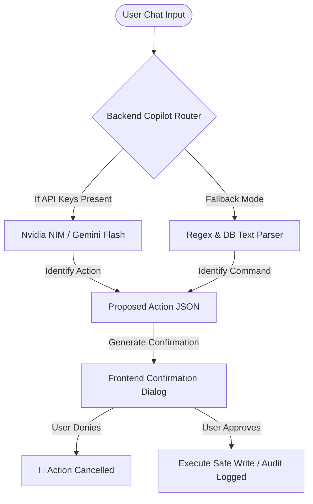

# Unified AI Features, Automation & Agentic Roadmap
## SpiderSmart Inventory Management System (IMS)

This document provides a single, unified blueprint of all intelligent features, virtual assistant capabilities, auto-classification tools, and agentic workflows for the SpiderSmart IMS. It outlines what is currently implemented (**[DONE]**), what is planned (**[REMAINING]**), and the configuration and operational necessities required to run these systems.

---

## 1. System Implementation Status Matrix

The following matrix contrasts the current state of implementation with the planned enhancements:

| Feature/Module | Type | Description | Status |
| :--- | :--- | :--- | :--- |
| **IMS Copilot Drawer UI** | AI Interface | Sparkles floating button, chat logs, and quick navigation chips. | **[DONE]** |
| **Dual-LLM Router** | Backend Integration | High-availability endpoint calling Nvidia Nemotron with Gemini fallback. | **[DONE]** |
| **Interactive Action Confirmation** | Safety Workflow | AI proposals are intercepted and require manual user approval before execution. | **[DONE]** |
| **Offline Fallback Engine** | Resiliency | Local regex parser, keyword stats QA, and fuzzy DB search. | **[DONE]** |
| **Auto-Classification Rules** | ML & Logic | Automates categorization/tagging on records based on metadata. | **[DONE]** |
| **Pattern & Keyword Discovery** | ML & Logic | Extracts top 10 recurring keywords from unclassified records. | **[DONE]** |
| **Rule Impact Simulation** | ML & Logic | Simulates new rules on unclassified records with preview and match counts. | **[DONE]** |
| **Retroactive Rule Application** | ML & Logic | Deploys rules immediately to all existing unclassified records. | **[DONE]** |
| **Semantic Vector Search** | AI Enhancement | Vector column using `pgvector` to support natural language queries (NLQ). | **[REMAINING]** |
| **Dynamic Compliance Advisor** | AI Enhancement | RAG-based assistant evaluating record retention against federal/state laws. | **[REMAINING]** |
| **Digital Compliance Officer Agent** | Agentic Workflow | Background agent sweeping databases, emailing sign-offs, and logging disposals. | **[REMAINING]** |
| **e-Discovery Case Investigator**| Agentic Workflow | Gathers related files, logs legal holds, and packages ZIP archives. | **[REMAINING]** |
| **Data Harmonization Agent** | Agentic Workflow | Sanitizes, normalizes, and repairs noisy CSV/Excel bulk imports. | **[REMAINING]** |
| **Warehouse Aisle-Shelf Routing** | Structural Upgrade| Relational warehouse mapping to optimize box layout and retrieval. | **[REMAINING]** |
| **Pre-Disposition Approvals** | Compliance Workflow| Dual-signoff notification workflows for record destruction. | **[REMAINING]** |

---

## 2. Deep-Dive: Implemented Features [DONE]

### 2.1 Interactive AI Copilot Assistant
The Copilot acts as a virtual operator allowing users to execute tasks and inspect records using natural language.



* **Frontend UI Component:** [Copilot.tsx](file:///E:/Skills/Webstack/Spider_internship/frontend/src/components/ui/Copilot.tsx)
  A slide-out drawer triggered by a modern floating action button (`Sparkles` / `Bot` icons). Includes custom message bubbles, loading animations, context-sensitive navigation chips (e.g., *"Go to CSV Import"*), and confirmation panels.
* **Backend Copilot Router:** [copilot.py](file:///E:/Skills/Webstack/Spider_internship/backend/app/routers/copilot.py)
  * **Dynamic Context Loading:** On every incoming message, the router executes queries to fetch system statistics (active record count, legal hold counts, records due for disposal, and samples of active entities/departments) to feed directly into the system prompt.
  * **Dual-Provider API Integration:** Attempts to call Nvidia NIM API first (using `nvidia/nemotron-3-ultra-550b-a55b` by default). In case of failure or if no key is configured, it falls back to Google's Gemini API (`gemini-1.5-flash`).
  * **Human-in-the-Loop Safe Execution:** If the LLM determines a database modification is requested, it replies with a structured JSON block. The backend intercepts this block, parses it, suppresses immediate execution, and returns a `pending_action` parameter. The frontend renders this as a confirm/cancel prompt, requiring explicit user approval before execution.

* **Offline Fallback Engine:**
  If no API keys are present, the backend falls back to an offline pattern matcher supporting:
  * **QA Keywords:** Direct checks for "total records", "holds", or "dispositions".
  * **Fuzzy Database Search:** Evaluates the `find [keyword]` syntax using PostgreSQL `ilike` filters over descriptions and barcodes.
  * **Shorthand Task Commands:** Evaluates exact command structures to bypass chat interfaces:
    * `hold [barcode] [reason]`
    * `unhold [barcode]`
    * `tag [barcode] [tag]`
    * `categorize [barcode] [category]`

### 2.2 Rule-Based Auto-Classification Engine
* **Service Module:** [classification_service.py](file:///E:/Skills/Webstack/Spider_internship/backend/app/services/classification_service.py)
* **Metadata Rule Evaluator:** Evaluates active user-defined rules with operators (`contains`, `equals`, `starts_with`) against record descriptions to set categories or add tags automatically on record creation.
* **Keyword Pattern Discovery:** Scans all uncategorized records and extracts the top 10 most recurring terms (length $\ge$ 4) using frequency counting.
* **Simulation Sandbox:** Allows administrators to test new rules against current uncategorized records, returning match counts and sample records before deployment.
* **Retroactive Rules Applier:** Deploys new rules immediately to all existing unclassified records in the database.

---

## 3. Deep-Dive: Planned Enhancements [REMAINING]

### 3.1 Semantic Search & NLQ (Phase 1)
* **Objective:** Enable pgvector in Supabase and add a vector column (`embedding` vector) to `inventory_records`.
* **Implementation:** Create database triggers or Celery tasks to call `text-embedding-3-small` on record insertion/update. Modify backend search endpoints to perform similarity calculations.
* **Result:** Search queries like "financial reports" return records with descriptions like "invoice statements" or "tax filings" even if "financial" isn't explicitly written.

### 3.2 Digital Compliance Officer (DCO) Agent (Phase 2)
```mermaid
sequenceDiagram
    participant DCO as DCO Agent
    participant DB as Supabase DB
    participant Mgr as Dept Manager (Human)
    participant Aud as Audit Trail (SHA-256)
    
    loop Daily Schedule
        DCO->HDB: Query records approaching retention expiration
        DB--HHDCO: Return due records
        DCO->HDCO: Draft disposal manifest & legal justification
        DCO->HMgr: Email manifest and request approval
        Note over Mgr: Manager signs off / denies
        Mgr--HHDCO: Approval response (Signed JWT)
        alt Approved
            DCO->HDB: Mark disposition_status = 'DISPOSED', is_active = false
            DCO->HAud: Log action 'BULK_DISPOSE' + Sign-off metadata
        else Denied
            DCO->HDB: Place record on temporary 90-day hold
            DCO->HAud: Log hold reason
        end
    end
```
* **Objective:** Build a scheduled background task that queries records marked `DUE` for disposition, groups them by department, drafts retention warning manifests, sends approval alerts to department heads, and safely archives/deletes confirmed records.

### 3.3 e-Discovery Case Investigator Agent (Phase 2)
* **Objective:** An agent triggered when a new legal hold is declared (e.g. *"SEC Inquiry 2026"*).
* **Implementation:** Autonomously scans records using semantic vector criteria, locks matching items by setting `legal_hold = True`, and packages them into a tamper-evident ZIP archive containing compliance history logs for auditing.

### 3.4 Data Harmonization Agent (Phase 3)
* **Objective:** Clean messy bulk CSV/Excel imports.
* **Implementation:** Parses uploaded sheets, resolves category spelling discrepancies (e.g., standardizing `Finances` to `Finance`), flags anomalies (such as invalid dates or missing barcodes), and presents a correction dashboard to the user.

---

## 4. Operational Necessities (Deployment & Configuration)

To ensure these features run smoothly in development and production environments, the following configurations are required:

### 4.1 Environment Variables Setup
You must specify the LLM parameters in `backend/.env`. If these are omitted, the system defaults to the Offline Fallback mode.

```bash
# ==========================================
# AI & COPILOT SETTINGS
# ==========================================
# Google Gemini Setup
GEMINI_API_KEY="AIzaSyYourGeminiApiKeyHere"

# Nvidia NIM Setup (Preferred)
NVIDIA_API_KEY="nvapi-YourNvidiaApiKeyHere"
NVIDIA_MODEL="nvidia/nemotron-3-ultra-550b-a55b"
```

### 4.2 Security, Scoping & Role-Based Access Control (RBAC)
When executing actions proposed by the Copilot, the system enforces the user's roles from the JWT auth payload:
* **`SYSTEM_ADMIN` / `RECORDS_MANAGER`:** Full access to confirm any actions (e.g. `create_record`, `edit_record`, `dispose_record`, `apply_legal_hold`).
* **`KNOWLEDGE_WORKER`:** Can confirm `create_record`, `edit_record`, `add_tag`, `set_category`. Restricted from legal hold modification and record disposal.
* **`AUDITOR`:** Read-only access. Restricted from confirming any database write action.

### 4.3 Audit Integration
Every action confirmed via the Copilot UI must pass through `create_audit_log` inside [audit_service.py](file:///E:/Skills/Webstack/Spider_internship/backend/app/services/audit_service.py).
* All audit logs are cryptographically linked using SHA-256 chaining.
* Actions performed via the assistant are appended with metadata:
  ```json
  "changes": {
      "triggered_by": "Copilot",
      "reason": "User confirmed AI action proposal"
  }
  ```

### 4.4 Error Handling & Timeout Thresholds
To ensure the UI remains responsive, the backend implements:
* **Httpx Timeout Boundaries:** A strict `12.0s` limit for Nvidia completions and `10.0s` for Gemini completions.
* **API Failover Strategy:** If the Nvidia request times out or receives a `502/503/429` status code, the router immediately initiates a fallback call to Gemini. If both fail, it returns an offline response seamlessly without crashing.
