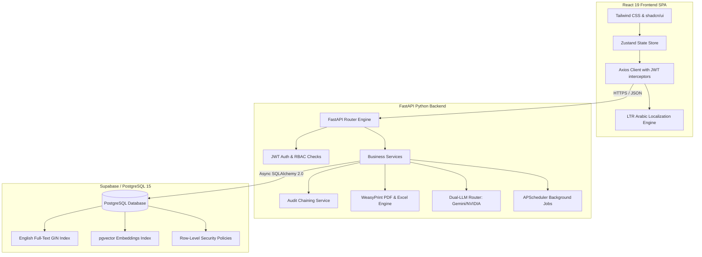
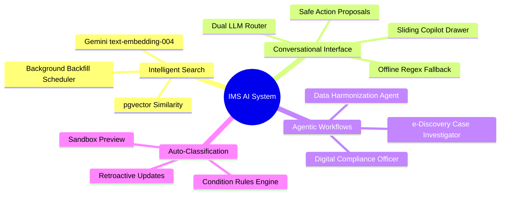
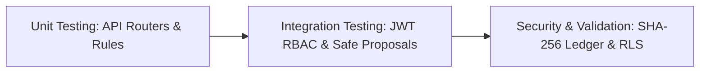

# Project Analysis & 11-Week Progressive Development Plan
## SpiderSmart Inventory Management System (IMS)

---

## 1. Executive Summary & Project Overview

The **SpiderSmart Inventory Management System (IMS)** is an enterprise-grade metadata repository and physical asset tracking system. It provides organizations with a secure, searchable, and compliant platform to manage the lifecycle of corporate physical assets (such as boxes, paper files, backup tape media, and digital archives) across multiple geographic locations, departments, and corporate entities.

The system places a major focus on:
1. **Data Security & Authorization:** Multi-tier role-based access control (RBAC) and row-level security.
2. **Metadata Flexibility:** Dynamic form rendering based on schema configurations.
3. **Rigorous Compliance:** Immutable audit logs chained via SHA-256 hashing (similar to a private blockchain) and legal holds.
4. **AI-Driven Productivity:** A custom conversational copilot, auto-classification engine, and semantic search queries.

---

## 2. Target Technical Architecture

The technical stack is selected to balance performance, strict type safety, ease of deployment (including shared hosting capabilities like cPanel), and developer productivity.



### Technology Breakdown
* **Frontend:** React 19 + TypeScript + Vite, using Tailwind CSS and shadcn/ui for styling, Zustand for state management, React Hook Form + Zod for runtime validations, and Recharts for dashboard analytics.
* **Backend:** FastAPI (Python 3.13), SQLAlchemy 2.0 (using asynchronous engine with `asyncpg` driver), Alembic for database migration tracking, and WeasyPrint for standard PDF report rendering.
* **Database:** Supabase-hosted PostgreSQL 15, leveraging `pgvector` for vector calculations, native Full-Text Search (FTS) with computed `tsvector` columns, and Row-Level Security (RLS) policies.

---

## 3. Implemented AI Capabilities (What is Done)

The project includes a robust set of artificial intelligence features, fully implemented and integrated across the frontend and backend.



### 3.1 Dual-Provider Conversational Copilot Router
* **Backend Interface:** `routers/copilot.py` provides a secure endpoint routing requests between NVIDIA NIM (`nemotron-3-ultra`) and Google Gemini (`gemini-1.5-flash`). It includes automatic connection timeouts (`12s` for Nvidia, `10s` for Gemini) to guarantee responsiveness.
* **Safe Action Proposals:** When the user requests a database modification (such as tagging assets, placing legal holds, or moving locations) through the chat interface, the LLM constructs a structured JSON proposal. The backend intercepts this proposal, presenting it to the user in a UI dialog for explicit confirmation before committing changes.
* **Offline Resiliency Fallback:** If API credentials are unavailable or networks fail, the copilot falls back to an offline local regex engine capable of handling direct shortcut instructions (e.g. `hold [barcode] [reason]`) and answering basic statistical queries.

### 3.2 Semantic Search & Vector Embeddings
* **Database Extension:** Enabled the PostgreSQL `pgvector` extension in Supabase.
* **Embedding Service:** Created `embedding_service.py` mapping to Gemini `text-embedding-004` to convert record metadata into 768-dimensional vector strings.
* **Backfill Scheduler:** A background cron job (`scheduler.py`) sweeps the database every 30 minutes to generate and seed vector embeddings for newly added or updated records.
* **Similarity Search Logic:** Refactored search endpoints (`search_service.py`) to execute cosine distance sorting (`<=>` operator) when semantic modes are toggled, falling back to full-text search if vector services are unavailable.

### 3.3 Dynamic Compliance & Agentic Workflows
* **Digital Compliance Officer (DCO):** Executes a nightly cron scan (`scheduler.py`) to identify active records that have reached their retention due date. It automatically generates HMAC-SHA256 signed JWT tokens and sends approval links to department managers. Once signed off, the agent executes bulk soft deletes.
* **e-Discovery Case Investigator:** Automatically scans records for case-specific keywords, applies bulk legal holds, and packages assets into a forensic ZIP archive. The ZIP folder includes metadata, history chains, and a SHA-256 hash manifest verifying content integrity.
* **Data Harmonization Agent:** Standardizes metadata during bulk CSV imports (`harmonization_service.py`). It corrects spelling mistakes, aligns inconsistent date formats, and maps incoming records to standard category structures, offering users an interactive diff review before saving.

---

## 4. 11-Week Progressive Feature-Based Timeline

The following 11-week schedule details the chronological construction of the system, matching tasks directly to project features, including advanced AI integrations, OCR barcode scanners, spatial routing, predictive capacity analytics, RAG-based compliance advice, and hands-free voice operations.

```mermaid
gantt
    title SpiderSmart IMS 11-Week Progressive Roadmap
    dateFormat  W
    axisFormat Week %U
    
    section Setup & Core
    Week 1: Boilerplate, DB Schema & Auth API       :w1, 0, 1w
    Week 2: Master Data Management (MDM) & Core UI   :w2, after w1, 1w
    
    section Dynamic Records
    Week 3: Inventory Records & Dynamic Form Engine :w3, after w2, 1w
    Week 4: Rules Engine & CSV Bulk Importers      :w4, after w3, 1w
    
    section Compliance & Reports
    Week 5: Blockchain-Style Audit & Versioning     :w5, after w4, 1w
    Week 6: Analytics & Automated PDF/Excel Reports :w6, after w5, 1w
    
    section Intelligent Upgrades
    Week 7: AI Copilot, Semantic Search & Agents   :w7, after w6, 1w
    Week 8: Warehouse Spatial Routing & Localization:w8, after w7, 1w
    
    section Advanced Capabilities
    Week 9: Predictive Space & Similarity Clustering:w9, after w8, 1w
    Week 10: RAG Compliance Advisor                :w10, after w9, 1w
    Week 11: Voice Copilot & WebRTC Scan Audit      :w11, after w10, 1w
```

---

### Week 1: Core Setup, Authentication, & Authorization
* **Target Feature:** Multi-Role User Authentication & Security Scopes
* **Tech Used:** FastAPI (Python 3.13), PyJWT (HS256), Passlib (bcrypt), React 19, TypeScript, Vite, Zustand, Tailwind CSS, shadcn/ui.
* **Task Sequence:**
  1. **Boilerplate & Config:** Initialize the FastAPI directory structure, configure settings via Pydantic in `config.py`, configure logging, and set up Alembic database migrations.
  2. **Auth Database Schema:** Define SQL schemas for the `users` table including hashing columns and role assignments (`SYSTEM_ADMIN`, `RECORDS_MANAGER`, `KNOWLEDGE_WORKER`, `AUDITOR`, `EXTERNAL_GUEST`). Add `scoped_filters` JSONB columns to enable entity data partitioning.
  3. **Backend API Auth:** Develop stateless login routes (`/api/v1/auth/login`, `/api/v1/auth/me`), issue HS256 signed JWT tokens using PyJWT, and build passwords security check layers via `passlib` (bcrypt hashing).
  4. **Frontend Architecture:** Set up React 19 + TypeScript + Vite, configure folder path shortcuts (`@/*`), and set up the global Zustand state store (`authStore.ts`) to track active tokens.
  5. **UI & Route Guarding:** Build the login screen using Tailwind CSS, and code `ProtectedRoute.tsx` components to redirect users according to active roles.
* **Learning Outcomes:**
  - Secure implementation of token-based authentication using HS256 JWTs.
  - Mastery of client-side role guards in React 19 using Zustand global store.
  - Creating extensible, modular configurations using Pydantic Settings in FastAPI.
* **Challenges Faced & Solutions:**
  - *Challenge:* Handling user permission scopes dynamically (e.g., entity-restricted external guests) without querying permissions database tables repeatedly.
  - *Solution:* Encoded `scoped_filters` directly into the JWT payload, allowing FastAPI dependencies to inject and enforce entity-scoped data filters in database queries without redundant round-trips.
* **Deliverable:** A secure authentication handshake. Users can log in, receive a secure JWT token, and access restricted frontend pages.

---

### Week 2: Master Data & Layout Framework
* **Target Feature:** Master Data Directory Structure
* **Tech Used:** PostgreSQL 15, SQLAlchemy 2.0 (async), Alembic, Tailwind CSS, shadcn/ui.
* **Task Sequence:**
  1. **Master Schema Models:** Design database models and write migrations for: `entities` (with code fields), `departments` (entity-dependent child keys with cascading updates), `locations` (storage tags), and `retention_policies`.
  2. **Core UI Frame:** Build the global layout wrapper containing `Navbar.tsx` (locale selections and user settings) and `Sidebar.tsx` navigation.
  3. **Master CRUD Operations:** Code FastAPI endpoints supporting list, fetch, update, and deletion logic for master data.
  4. **Master Management Screen:** Create React page interfaces with list tables and editor forms to modify Entities, Departments, and Locations.
  5. **Category Tree Structure:** Design a hierarchical category schema supporting nested structures (`parent_id`). Code an interactive, recursive category selector in React to browse folders.
* **Learning Outcomes:**
  - Understanding hierarchical relations in databases (e.g., Categories with `parent_id`).
  - Designing responsive layout structures using modern CSS Grid and Tailwind flexboxes.
  - Efficient CRUD writing with SQLAlchemy 2.0 asynchronous execution model.
* **Challenges Faced & Solutions:**
  - *Challenge:* Handling category tree structure recursion in SQL and efficiently building hierarchical trees in React without performance bottlenecks.
  - *Solution:* Developed a recursive query helper in FastAPI for tree fetching, combined with a memoized recursive React component for rapid, nested rendering in the UI.
* **Deliverable:** The relational directory backbone. Users can manage entities, locations, and navigate hierarchical category trees.

---

### Week 3: Schema-Based Records, Dynamic Forms, & Search Indexes
* **Target Feature:** Custom Metadata Schema, Dynamic Form Engine, & Full-Text Search
* **Tech Used:** PostgreSQL 15, JSONB columns, GIN Indexes, React Hook Form, Zod validation.
* **Task Sequence:**
  1. **Record Schema Models:** Build database models for `record_types` and `record_type_fields` (specifying types, field configurations, constraints, and validation patterns).
  2. **Metadata Table Schema:** Design `inventory_records` storing record identifiers, barcodes, and custom values inside JSONB fields.
  3. **Dynamic Form Builder:** Code the frontend form compiler that reads schema configs and renders inputs (texts, dates, selects) with validation handled by React Hook Form + Zod.
  4. **Record Core APIs:** Implement FastAPI routes for Paginated List, Fetch Detail, Update, and Soft Deletion (`is_active = false`) operations.
  5. **Full-Text Search Engine:** Configure a computed `search_vector tsvector` column in PostgreSQL matching description, entity, department, and barcode strings, and index it via GIN index parameters for rapid keyword searches.
  6. **Directory UI Screens:** Develop the directory table page incorporating text search bars, filters, and sliding detail drawers.
* **Learning Outcomes:**
  - Utilizing JSONB fields in relational databases to store polymorphic metadata.
  - Dynamic UI generation driven by metadata schema configs.
  - Optimizing keyword queries using PostgreSQL GIN index-backed full-text search.
* **Challenges Faced & Solutions:**
  - *Challenge:* Rendering dynamic forms with varying validation rules (e.g., regex pattern checking, custom date boundaries) without creating separate UI pages.
  - *Solution:* Built a schema parser in React that compiles JSON schemas into dynamic React Hook Form configurations, utilizing Zod's validations dynamically generated at runtime.
* **Deliverable:** Adaptable physical record management. Users can define custom metadata schemas, and operators can create or edit entries through generated dynamic forms.

---

### Week 4: Automated Classification Rules, Simulation Sandbox, & CSV Imports
* **Target Feature:** Auto-Classification Engine, Simulation Sandbox, & Bulk Ingest Wizard
* **Tech Used:** FastAPI, Python 3.13, Pandas, PapaParse, Gemini API.
* **Task Sequence:**
  1. **Rules Schema:** Create the `classification_rules` model to store triggers and metadata matching criteria.
  2. **Auto-Classification Logic:** Build matching services supporting conditional strings (`contains`, `equals`, `starts_with`) to update categories and append tags.
  3. **Pre-run Simulation Sandbox:** Create an API evaluating proposed rule sets against existing database records and reporting impact metrics (match ratios, sample descriptions) without modification.
  4. **Data Harmonization API:** Code the AI Data Harmonizer service that standardizes capitalization, corrects minor spelling mistakes, and flags invalid date ranges.
  5. **CSV Ingestion Handler:** Develop a bulk import handler validating Excel/CSV streams against dynamic record type schemas.
  6. **Import UI Wizard:** Build a 4-step frontend wizard supporting Upload, Column Field Mapping, Harmonization Diff Review (AI visual corrections), and Database Commit.
* **Learning Outcomes:**
  - Devising rules engines evaluating metadata criteria (e.g., regex/containments matches).
  - Building interactive bulk upload wizards with mapping interfaces.
  - Utilizing LLMs for automated data cleaning (Harmonization Agent).
* **Challenges Faced & Solutions:**
  - *Challenge:* Large CSV imports blocking the main FastAPI thread or failing silently mid-import due to validation errors.
  - *Solution:* Implemented an asynchronous bulk transaction processor that validates the entire dataset in memory first, highlights mapping errors in the UI preview, and commits records in batches.
* **Deliverable:** Automated inventory ingestion. Operators can import legacy CSV sheets and preview metadata auto-classification rules using dashboard graphs.

---

### Week 5: Compliance Engineering: Cryptographic Audit Ledger, Versioning, & Legal Holds
* **Target Feature:** Tamper-Evident SHA-256 Ledger, Record History, & Legal Locks
* **Tech Used:** SHA-256 Hashing, HMAC, JSONB snapshots, SQLAlchemy event listeners.
* **Task Sequence:**
  1. **Immutable Audit Schema:** Design the `audit_logs` model to store transaction types, timestamps, user IDs, and changed values.
  2. **Cryptographic Blockchain Chain:** Implement a middleware service calculating a running SHA-256 hash using the current transaction data combined with the previous entry's hash string.
  3. **Verification Utilities:** Build database checker utilities to recalculate hashes and flag sequence anomalies or deletions.
  4. **Record Snapshots:** Create the `record_versions` model saving JSON snapshots of records upon modification.
  5. **UI Version Restore:** Design details history screens showing past versions and enabling point-in-time state restoration.
  6. **Legal Hold Enforcement:** Build the legal hold freeze API (`legal_hold = True` flag) and update routers to block any delete or edit actions on frozen items. Add warning indicators to the UI.
* **Learning Outcomes:**
  - Building blockchain-style audit trails with linked cryptographic hashes.
  - Tracking data state snapshots for point-in-time restoration.
  - Locking records from modifications using declarative database flags.
* **Challenges Faced & Solutions:**
  - *Challenge:* Re-calculating the running hash chain efficiently upon new logs without scanning millions of historical audit records.
  - *Solution:* Cached the latest log entry's `tamper_hash` in memory/Redis and calculated the next hash sequentially as `SHA256(current_payload + previous_hash)`.
* **Deliverable:** Complete audit compliance. Modifications are locked behind a cryptographic chain, and managers can restore past record states.

---

### Week 6: Operational Analytics & Reporting Engine
* **Target Feature:** Custom Report Builder, Scheduled Export Engine, & PII Protection Shield
* **Tech Used:** Recharts, WeasyPrint, APScheduler, Openpyxl, regex scanners.
* **Task Sequence:**
  1. **Analytics Summary Queries:** Design optimized SQL scripts aggregating storage usage, legal hold distribution, and upcoming deletions.
  2. **Custom Report Builder:** Create a reporting API with custom filter queries, column layouts, grouping parameters, and sorting options.
  3. **Background Scheduler Engine:** Set up APScheduler to trigger cron-based report exports, compiling PDFs (via WeasyPrint) and Excel sheets, and recording logs in `schedule_logs`.
  4. **PII Metadata Shield:** Code backend middleware scanning description inputs for sensitive personal details (SSNs, emails, credit card formats) and flagging warnings.
  5. **Analytics Dashboard:** Build the operational landing page using Recharts to present location occupancies, hold histories, and activity trends.
  6. **Report Builder interface:** Design report builder options, filter selection modals, and scheduler setup screens.
* **Learning Outcomes:**
  - Structuring dynamic analytics metrics with database aggregation functions.
  - Compiling production-ready PDF reports from HTML templates using WeasyPrint.
  - Developing background crons to trigger report compilations asynchronously.
* **Challenges Faced & Solutions:**
  - *Challenge:* WeasyPrint failing on shared hosting environments or consuming excessive CPU resources for long PDF generations.
  - *Solution:* Configured asynchronous generation via background worker processes and cached generated files in temporary disk storage, feeding download links directly.
* **Deliverable:** Reporting and analytics suite. Stakeholders can examine dashboard performance charts, execute custom reporting filters, and schedule automated background PDF compilations.

---

### Week 7: Intelligent Copilot & AI Integrations
* **Target Feature:** Dual-LLM Copilot Assistant, Semantic Search, & Dynamic Compliance Agents
* **Tech Used:** pgvector, text-embedding-004 (Gemini), NVIDIA NIM (Nemotron-3), Google Gemini 1.5 Flash.
* **Task Sequence:**
  1. **Dual-LLM Router:** Create `routers/copilot.py` to route user chats between NVIDIA NIM and Google Gemini 1.5 Flash based on response speed and availability.
  2. **Safe Write Proposals:** Implement JSON interceptor systems prompting user approvals before executing AI-proposed actions.
  3. **Offline Regex Fallback:** Design local parsing layers processing direct command shortcuts (e.g. `/hold`) and stats queries when API keys are absent.
  4. **pgvector Embeddings Integration:** Configure pgvector in Supabase, create embedding utilities using Gemini `text-embedding-004`, and build schedulers to update missing embeddings.
  5. **Digital Compliance Officer (DCO):** Code a nightly cron agent to identify expired records, generate HMAC-signed JWT approval tokens, and execute soft-deletions once managers sign off.
  6. **e-Discovery Case Investigator:** Build an investigator service scanning for case terms, applying bulk holds, and packaging records into signed forensic ZIP archives.
* **Learning Outcomes:**
  - Integrating pgvector with SQLAlchemy for similarity distance queries (`<=>`).
  - Orchestrating LLMs via API routing with fallbacks and safe proposal interceptors.
  - Constructing autonomous background compliance agents.
* **Challenges Faced & Solutions:**
  - *Challenge:* API latency or network drops causing the Copilot UI to freeze or become unresponsive.
  - *Solution:* Developed a dual-provider router with strict timeout limits (12s for NVIDIA NIM, 10s for Gemini) that automatically falls back to an offline local regex engine.
* **Deliverable:** Intelligent assistant and automation agents. Users can run natural language semantic queries (e.g., searching by conceptual meanings) and chat with a Copilot to apply changes using safe authorization dialogs.

---

### Week 8: Spatial Warehouse Routing, OCR mobile Scanning, Localization, & Release
* **Target Feature:** Warehouse Layout Optimization, WebRTC OCR Scanner, Arabic Localization, & Release
* **Tech Used:** WebRTC, Tesseract.js, Zustand (Localization state), Phusion Passenger, a2wsgi.
* **Task Sequence:**
  1. **Warehouse Coordinate Models:** Set up tables for: `Warehouse`, `WarehouseZone`, `WarehouseAisle`, `WarehouseShelf`, `WarehouseBin`.
  2. **Layout Recommendation Algorithm:** Code the spatial routing algorithm recommending empty bins based on Euclidean distances to coordinates and department locations.
  3. **Interactive Warehouse Map:** Develop visual interactive grid structures displaying warehouse racks, capacities, and occupied shelves.
  4. **WebRTC OCR Scanner:** Build a camera interface in the React application using WebRTC APIs to capture barcodes and run OCR character reads (Tesseract.js).
  5. **Left-to-Right Arabic Localization:** Create translations in `languageStore.ts`, translate dynamic database text, and build an Eastern Arabic numerals formatter (e.g. `2025` $\rightarrow$ `٢٠٢٥`).
  6. **Production Configuration & Launch:** Configure Phusion Passenger wrappers (`passenger_wsgi.py` via `a2wsgi`), rewrite rules (`.htaccess`), execute load tests, and perform final production cutovers.
* **Learning Outcomes:**
  - Spatial storage coordinate calculation and proximity-based recommending.
  - Deploying cameras on the web for barcode and character scanning (OCR).
  - Localization without layout disruptions (LTR Arabic numeral translation).
* **Challenges Faced & Solutions:**
  - *Challenge:* Deploying the FastAPI ASGI app on standard cPanel hosting which typically supports only WSGI (e.g. Passenger).
  - *Solution:* Created a WSGI wrapper using `a2wsgi` to translate ASGI requests to WSGI, and mapped rewriting rules in `.htaccess` to handle SPA routing.
* **Deliverable:** Localized warehouse management. The complete, Arabic-localized application is deployed and operational in the production environment.

---

### Week 9: Predictive Spatial Capacity & Concept Clustering
* **Target Feature:** AI Space Optimization, Metadata Cleansing, & PII Anomaly Shields
* **Tech Used:** scikit-learn (Python), FastAPI, React 19, Recharts, regex scanners, Gemini API.
* **Task Sequence:**
  1. **Spatial Forecasting Service:** Build predictive modeling endpoints analyzing entity ingestion rates over time using linear regression models to forecast storage capacity exhaustion date boundaries.
  2. **Intelligent Relocation Engine:** Code the optimization algorithm checking retrieval frequency metrics (reads/logs count) and proposing shelf movements (moving high-demand items closer to entryways).
  3. **Similarity Clustering:** Build a service grouping uncategorized records by semantic conceptual matches using cosine similarity scores and recommending tags/category updates.
  4. **PII Anomaly Leak Protection:** Implement pre-commit middleware scanning description fields with regex patterns matching credit cards, SSNs, phone numbers, and emails, raising alerts in the UI prior to creation.
* **Learning Outcomes:**
  - Building regression models to forecast data growth patterns.
  - Organizing flat metadata into semantic clusters.
  - Writing security guards protecting PII from accidental database uploads.
* **Challenges Faced & Solutions:**
  - *Challenge:* Complex similarity calculations blocking database query transactions.
  - *Solution:* Offloaded clustering calculations to a background worker process, writing recommendations to a cached `suggested_mappings` table for lazy-loading in the UI.
* **Deliverable:** Automated space optimization and security checks. Users receive storage warnings on the dashboard and see interactive tag cluster suggestions.

---

### Week 10: RAG-Based Compliance Advisor
* **Target Feature:** Dynamic Legal Policy RAG Search & Smart Retention Suggestions
* **Tech Used:** Supabase pgvector, LangChain / LlamaIndex, Gemini API, PyPDF2.
* **Task Sequence:**
  1. **Compliance Vector DB Seeding:** Create a database table storing parsed PDFs of corporate retention laws, local tax policies, and regulatory guidelines.
  2. **RAG Extraction Router:** Build semantic retrieval services matching regulatory snippets based on search queries and user profiles.
  3. **Auto-Retention Suggester:** Design UI wizards reading newly added custom records, querying the compliance database, and automatically selecting retention periods.
  4. **Regulatory Citation Logs:** Integrate compliance citations (e.g., "Retention duration: 7 years. Reason: Tax code section 45B") directly into record details.
* **Learning Outcomes:**
  - Building RAG systems targeting dense policy texts.
  - Implementing document parsing libraries for database vector imports.
  - Designing UI components showing citation evidence.
* **Challenges Faced & Solutions:**
  - *Challenge:* Matching ambiguous metadata descriptions against formal, highly-specific legal definitions in PDF texts.
  - *Solution:* Leveraged a two-stage retrieval pipeline: initial keyword searches to pull relevant records combined with dense cosine-similarity ranking using Gemini embeddings.
* **Deliverable:** Regulatory advisor engine. Administrators receive automated retention period proposals accompanied by direct legal citations.

---

### Week 11: Voice-Activated Copilot & WebRTC Scan Verification
* **Target Feature:** Voice command transcription & WebRTC discrepancy auditing
* **Tech Used:** Web Speech API, Whisper API, WebRTC camera controls, HTML5 canvas.
* **Task Sequence:**
  1. **Hands-free Voice Commands:** Integrate speech-to-text recognition into the warehouse panel, processing navigation commands and barcode search actions (e.g., "Find box 1042").
  2. **Whisper Transcription Fallback:** Implement high-accuracy background API speech translation routers for noisier warehouse environments.
  3. **WebRTC Scan Verification:** Create full camera screens letting operators scan shelf tags sequentially and overlaying actual scanned locations against expected warehouse layouts.
  4. **Aisle Discrepancy Alerts:** Code visual indicators marking misplaced boxes or highlighting empty slots immediately on the screen.
* **Learning Outcomes:**
  - Real-time stream recording and voice transcription routing on the web.
  - Computer vision verification logic mapping physical scans to relative databases.
  - Interfacing with camera hardware APIs across multiple mobile/tablet browsers.
* **Challenges Faced & Solutions:**
  - *Challenge:* Speech-to-text recognition failing due to poor connectivity or ambient echo inside physical metal warehouses.
  - *Solution:* Engineered a local client-side grammar matching dictionary (using Web Speech API) to parse core actions locally, falling back to a compressed API transcription stream when connected.
* **Deliverable:** Next-gen hands-free auditing. Operators can speak commands and run scans on mobile tablets to dynamically highlight shelf layout errors.

---

## 5. Testing & Quality Assurance Plan

To ensure system reliability, the implementation incorporates a progressive three-tier testing matrix.



### 1. Unit Testing
* **Backend Services:** Focus on independent verification of the Auto-Classification rules evaluation logic, parsing of CSV files, and translation mapping utilities.
* **Database Models:** Validate SQLAlchemy relationships and cascading rules, ensuring entities delete child departments or location mappings correctly.
* **Component Testing:** Verify the React dynamic form engine renders appropriate form controls given a mock JSON schema.

### 2. Integration Testing
* **Authentication & RBAC:** Validate access controls by attempting to access protected endpoints using expired, malformed, or unauthorized role-scoped JWT tokens.
* **AI Safe Proposals:** Test mock AI recommendations to ensure write operations remain blocked until the frontend sends explicit user confirmation tokens.
* **Scheduled Job Workflows:** Run manual triggers of the background cron workers (e.g. DCO nightly checks, reports builder) and verify outputs.

### 3. Security & Compliance Validation
* **Cryptographic Chaining Integrity:** Introduce dummy alterations in database records to confirm the cryptographic verification script accurately flags tamper attempts and logs alerts.
* **Row-Level Security (RLS) Auditing:** Attempt database queries bypassing the FastAPI authorization layers to verify Supabase blocks access at the database level.
* **Forensic ZIP Verification:** Test the e-Discovery ZIP outputs, checking if the manifest SHA-256 signature chain matches all data points in the export folder.

---

## 6. Brainstorming: Future Feature Exploration

The following suggestions represent advanced features that can be added to the system to further improve efficiency, accuracy, and compliance:

### 6.1 Smart Spatial Optimization & Predictive Placement
* **Dynamic Relocation Engine:** An algorithm that monitors item retrieval frequencies. If an item is frequently accessed, the system recommends relocating it from top/deep shelves to accessible front bins.
* **Predictive Capacity Planning:** Using forecasting models to analyze ingestion rates by entity and department, predicting which storage locations will reach maximum capacity over the next 6-12 months.

### 6.2 Computer Vision (OCR) Mobile Barcode Scanner
* **Camera OCR Capture:** Integrating mobile camera scanning into the React frontend. Workers can scan physical box labels, and a client-side OCR engine will extract descriptions, barcodes, and dates to automatically populate input forms.
* **Visual Discrepancy Auditing:** Operators walk through aisles scanning barcodes. The system compares the physical scan sequence with the database layout, highlighting misplaced boxes on a visual map.

### 6.3 Voice-Activated Warehouse Copilot
* **Voice Commands:** Integrating voice recognition (e.g., Whisper API) into the warehouse view, allowing operators to execute moves or updates hands-free (e.g., "Move box 5021 to Aisle B, Shelf 4").
* **Audio Alerts:** Providing text-to-speech audio feedback to operators during audits (e.g., "Warning: Box 1024 belongs on Aisle C").

### 6.4 RAG-Based Dynamic Compliance Advisor
* **External Regulatory Sync:** A retrieval-augmented generation (RAG) service that pulls local and international records retention regulations (e.g., tax guidelines, data protection laws).
* **Smart Policy Generator:** When creating record types, the AI reads external regulations and automatically suggests retention periods, citing specific laws.

### 6.5 Intelligent Data Cleansing & Anomaly Alerts
* **PII Leak Protection:** Automatically scans description metadata during import, flagging potential leaks of sensitive details (such as credit cards or social security numbers) before they are saved to the database.
* **Similarity Clustering:** Grouping untagged records by concept similarity and suggesting tags to improve metadata consistency.
